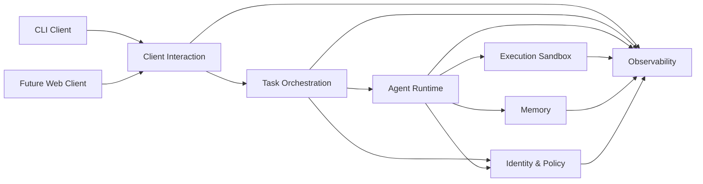

# Local Agent Harness Context Map

## Overview

This context map describes the major bounded contexts for the local AI agent harness and the relationships between them. The goal is to preserve a clean ubiquitous language and explicit boundaries while enabling the runtime to host a DeepAgent-based autonomous worker.

## Bounded Contexts

### Task Orchestration
Owns task intake, lifecycle, checkpoints, cancellation, retries, completion state, and run coordination.

### Agent Runtime
Owns primary-agent and sub-agent execution, model routing, skills, middleware, and interaction with runtime ports.

### Execution Sandbox
Owns rooted file access, command execution, environment policy, workspace boundaries, and artifact capture.

### Memory
Owns run memory, project memory, identity memory, retrieval policy, and durable promotion rules.

### Identity & Policy
Owns `IDENTITY.md`, capability constraints, approval rules, escalation behavior, and operational principles.

### Client Interaction
Owns the runtime protocol, task snapshots, event stream shape, and client-discoverable action descriptors.

### Observability
Owns correlation IDs, event logs, traces, diagnostics, and runtime metrics.

## Relationship Model

## Upstream / Downstream View

### Upstream Providers

- **Identity & Policy** is upstream of Task Orchestration and Agent Runtime because it governs autonomy boundaries.
- **Client Interaction** is upstream of Task Orchestration from the perspective of command intake.

### Downstream Consumers

- **Task Orchestration** consumes Identity & Policy and invokes Agent Runtime.
- **Agent Runtime** consumes Execution Sandbox, Memory, and Identity & Policy.
- **Clients** consume Client Interaction representations and Observability output.

## Anti-Corruption Boundaries

### LangChain / DeepAgent Boundary
The Agent Runtime must expose internal domain-centric ports so that LangChain types do not leak into Task Orchestration, Client Interaction, or Memory.

### Filesystem / Host Boundary
Execution Sandbox must shield the rest of the system from raw host filesystem semantics and expose only governed workspace abstractions.

### Transport Boundary
Client Interaction must hide transport specifics so stdio, WebSocket, and HTTP+SSE can share the same conceptual protocol.

## Recommended Integration Patterns

### Task Orchestration -> Agent Runtime
Use an application service boundary such as `TaskRunner.run(task_contract)`.

### Agent Runtime -> Execution Sandbox
Use an `ExecutionSandbox` port with explicit file and command operations.

### Agent Runtime -> Memory
Use a `MemoryStore` port with typed scopes and promotion rules.

### Client Interaction -> Task Orchestration
Use command/query methods over JSON-RPC and event subscriptions for progress.

## Shared Kernel Candidates

The following concepts may live in a carefully controlled shared kernel package:

- task IDs, run IDs, correlation IDs
- event envelope schema
- task status enum
- artifact reference shape
- action descriptor schema
- configuration schema primitives

## Context Map Notes

- Task Orchestration is the coordinating context but should not absorb runtime or sandbox details.
- Agent Runtime is an adapter-heavy context and should remain isolated from client and transport concerns.
- Identity & Policy must remain authoritative; do not duplicate policy logic in clients.
- Observability should receive signals from all contexts but should not become a control dependency.
